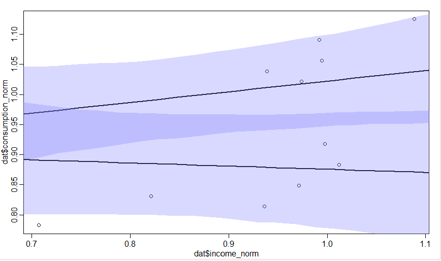
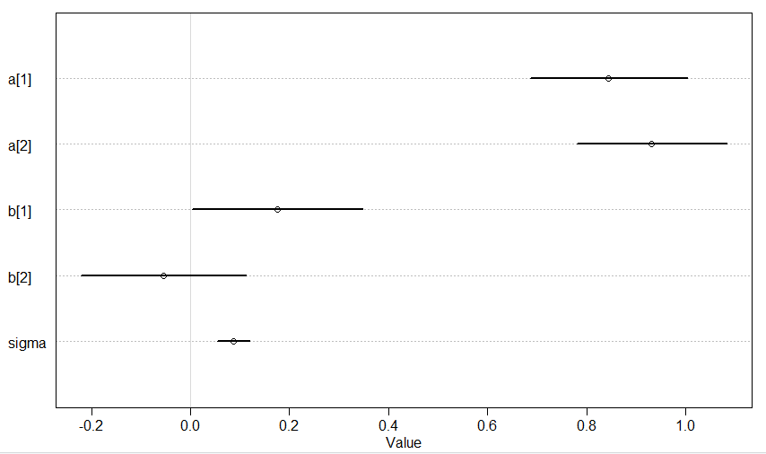
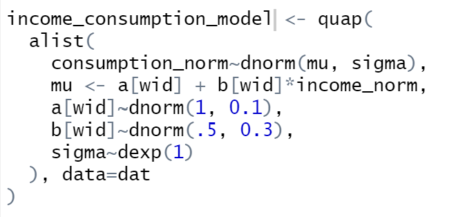
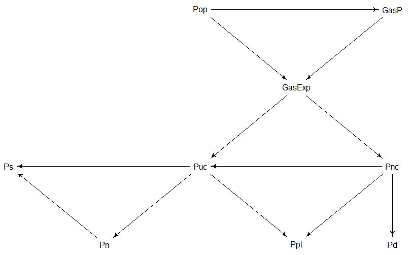
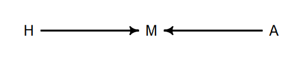
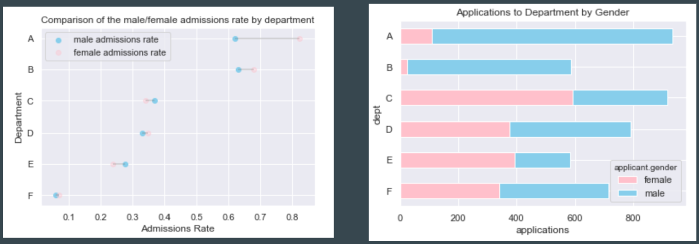
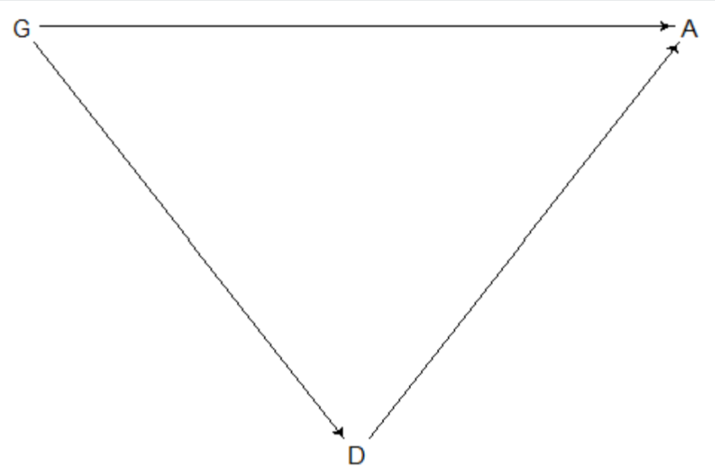
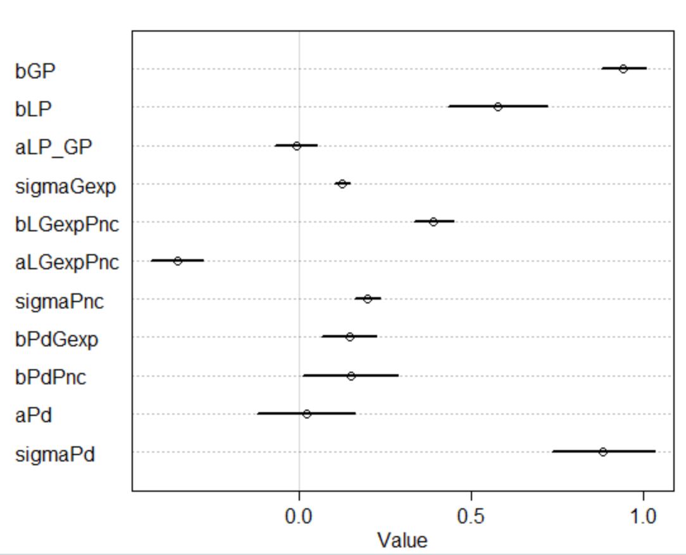
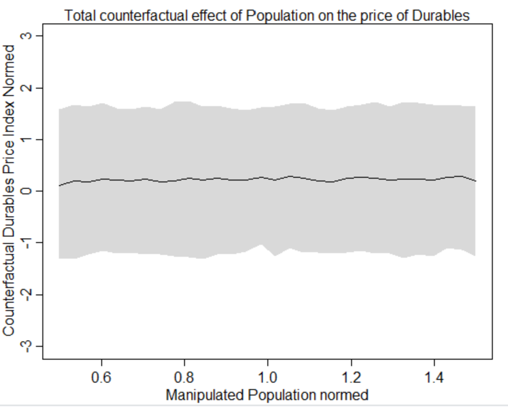
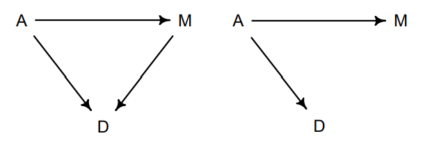

# Bayesian Statistics and Econometrics #
Kevin Ko \
3/15/2021\

This project was to read Richard McElreath's Statistical Relearning
in order to introduce myself to Bayesian Statistics. Of the concepts in the book,
I focused on Causal Inference for this project. I also decided to focus on
Econometrics data, so selected a [dataset](http://pages.stern.nyu.edu/~wgreene/Text/Edition7/tablelist8new.htm) on the effect of gas prices
on other economic indicators to explore.

## Introduction

The reader may be surpised to find that this project uses linear regression as
its primary tool, but this is the final capstone project of a Machine Learning
Engineer Course. This project serves as an introduction to Bayesian statistical
models, Causal Inference, and Econometrics. These are fields that I've been
hoping to explore for some time and the open-ended nature of this final
capstone project afforded me the opportunity to close this gap.

Linear Regression is often looked down upon in the machine-learning community.
This is after all, a discipline that values predictive ability more than anything
else and frequently solves problems by throwing vast amounts of computation at
vast amounts of data using non-linear methods to make predictions. In such an
environment, it is easy to forget about the elegant theory of linear regression
and the fact that it is still a widely-used tool in the sciences. Still, one
might ask what value does econometrics, linear regression, and Causal Inference
have for a Machine-learning practitioner?

The value that I see is primarily as an exploratory tool to disentangle which
variables are importent. By understanding the variables, one has a leg-up
when complex models fail. One can also anticipate bugs and access broader types
of research in the field.

A major highlight of the book is the exploration of causal inference and
confounding causal paths. This is the clearest exploration that I have seen
of the tired expression "corellation is not causation."

## Bayesian Statistics and Linear Models in Econometrics ##

The plot below is of the first dataset I explored related to econometrics and
it provides a compelling example of what you can explain with simple linear models.

 

 The top line is the relationship between income and consumption in non-war
 years. The bottom line is the relationship during years with war. The light-
 blue filled spaces capture the 97% confidence interval around the line.
 The relationship between war-years and non-war years is clearly illustrated in
 this plat. During non-war years, there is a positive slope so that with
 extra income, consumption increases. In war-years, the relationship is reversed.
 So that the slope is slightly negative (the zero-slope line is included in
 the 97% confidence interval). This means that during war-years, increased
 income may lead to less consumption or constant consumption.

 Another way of plotting the data is below.

 

 The plot above contains the coefficients that were determined by the model.
 In the brackets are indices that indicate whether the model is considering
 non-war datapoints or war datapoints. Non-war data points have the index 1
 and war-periods have the index 2. The relationships mentioned above are
 illustrated with b[1] and b[2]. b[1] is the slope for non-war periods. It is
 clearly positive-- even with the uncertainty from the 90% confidence interval.
 On the other hand the b[2] slope for war-periods is negative with a 90%
 confidence interval that includes 0. This means that during war-period,
 higher income does not appear to lead to higher spending.

## Model specification in Bayesian Statistics

Another interesting aspect of Bayesian Models is how models are specified.
Since the model is bayesian, the parameters must be specified with a distribution.
The dependent variable is also tied to a distribution, which is then connected
to the rest of the parameters and raw data with a link function.

the image above is the code used to specify the relationship between
income and consumption during war and non-war periods. The dependent
variable is consumption_norm in the first line. This observed data
from the dependent variable is specified to be a normal distribution with
parameters mu and sigma. Next, the mu parameter is defined with a link function.
This link function has two parameters a and b. a is the y-intercept and b
is the slope. income_norm is the independent variable. Finally, the
parameters a, b and sigma are specified with prior distributions, which
are starting points for the optimization algorithm that fits the final parameters.
Note that the wid is an index which indicates whether a data point was collected
for a period during the war or in a non-war period and indicates that two
models should be fit, one for each period.

## Gasoline Prices Dataset

The model I constructed for the gasoline prices dataset ended up being almost
entirely linear and didn't require the usage of the MCMC to train the model.
Instead, I used the quadratic approximation algorithm.
The model was constructed successively in stages, a nearly-final version
is below. It is constructed with the intuition that gas price changes
have a cascading effect on the economy, increasing the cost of new cars, public
transportation, and ultimately durable goods and non-consumables. A
final question left open by the graph is where does income sit in the graph.
I will analyze this question in a later section.

The variables in this graph are population (Pop), gas price(GasP), total
gas expenditure in US (GasExp), index for price of used car (Puc),
index for price of new car (Pnc), index for price of public transport (Ppt),
index for price of consumer durables (Pd),  index for price of nondurables (Pn),
and index for price of service (Ps).

The graph above is the entire model that I built. Running the model allows us
to infer what the impact of changing gas prices are on the other variables.
Of course, there are two considerations we need to keep in mind. First,
the graph is a hypothesis. The best proof for such graphs is running experiments.
Without experimentation, we can use the data to disprove portions from the
graph. Second, if the graph is correct, including all the variables can
introduce bias into the coefficients. This is called confounding or
collider bias. More intuitively, leaving out variables can
also lead to incorrect inference between variables. An example of this is
Simpson's Paradox.

Counfounding and Simpson's Paradox

Confounding is when a variable influence both the dependent variable and the
independent variable, so induces a spurious correlation if it's included in
the model. The correlation is spurious because even though the independent
variable and the dependent variable are independent, a correlation non
zero correlation is detected by the model. In other word, confounding states
it is possible to have non-zero correlation coefficients even if A is
independent of C. That is to say, you can have non-zero correlation coefficients even
if A doesn't cause C. This is an example of the the famous adage that
correlation is not causation.

Collider Bias is the reason there is confounding in linear models. In the
diagram below, we have variables happiness (H), marriage (M), and age (A).
In the diagram, marriage is the collider. Because H and A directly influence
marriage, including marriage in the model will give us a relationship that
ties ovservations of happiness to age, even though age does not cause happiness.

McElreath includes a simulation that illustrates this. It is reproduced below

1. Each year, 20 peopel are born with uniformly distributed happiness values.
2. Each year, each person ages one year. Happiness does not change.
3. At age 18, individuals can become married. The odds of marriage are
proportional to their Happiness
4. Once married, an individual remains married
5. After age 65, individuals leave the sample.

Explicitly, age does not impact happiness in the model, but marriage gives
you information about both age and happiness, inducing a correlation.

## Simpson's Paradox

You can also cause bias in your correlation coefficients by failing to condition
on values. A classic example of this is Simpson's bias and a famous dataset
that is affected by this bias is the UC Berkeley Admissions Bias dataset.

Simpson's paradox can be stated as the following. Both statements of the
following statements can be true

1. For the general population rate a > rate b
2. For a grouping of the population rate a < rate b

For the Berkely dataset, for the general population, men are admitted to
graduate school at a higher rate than women.

But once you look at the department level, women tend to be admitted at
a higher rate, but men tend to apply to departments with lots of applicants
and higher admissions rates. The following charts capture this relationship.

In the language of Causal inference, we can consider the graph below.

In this case, we are trying to predict the effect of gender (G) on age (A).
But gender also affects department (D), so by failing to include degree
in our model, we are biasing our prediction.

## The general rule

We've now considered two situations, one were you add the variable and it
produces a misleading correlation coeffecient and another were failing to
include a variable leads to a misleading correlation coefficient. What is the
general rule for when to include or exclude a variable? The rule is as follows

Consider independent variable (I) and dependent variable (D)
1. Consider all paths on the causal graph between I and D
  - Note that you can traverse an edge backwards
2. If the path contains a collider A->B<-C, then do not include the collider variable in the model
  - by including the collider, you are opening a biased path of information
3. If the path does not include a collider, include the variable
  - by including the path, you are closing paths of information that you are missing that would otherwise bias your prediction.

I note that even if you do everything right, there can be 'invisible paths'
that you cannot take into account because of unobserved variables.

## Applying the rule to define the impact of population (Pop) on the price of durables (Pd)

I reproduce the Gas Causal Graph that I've hypothesized below:

Since I'm interested in measuring the impact of population on durables, I need
to consider all paths from population to durables. There are 3 paths.

1. Pop -> GasExp -> Pnc -> Pd
2. Pop -> GasExp -> Puc <- Pnc -> Pd
3. Pop -> GasExp -> Puc -> Ppt <- Pnc -> Pd

Paths 2 and 3 contain colliders Puc and Ppt, so if we regress on all the variables
in path 1, we can measure the impact of population on the prices of durables.

In the included code, this is model 10. The resulting coefficients are below:

This graph is constructed edge by edge, so none of the coefficients is
directly relevant. For example bGP measures the effect of gas prices on
total gas expenditures (GasExp). We can get the total effect of population
on consumer durables from the model with simulation. McElreath calls this
"Counterfactual Simulation."

The model concludes that population has no statistically significant effect
on the price of durables. Especially notable is the amount of uncertainty in the
model. This is captured by the sigmaPd parameter which captures the noise
in the model after the regression. This is not in line with my original
hypothesis, so future areas of exploration are whether there is an error
in the model training or whether the changes in prices are due entirely to
the change in gas prices.

## Correctness of a graph

The previous section discusses that choosing which variables to include
in a model can be important if you have the correct causal graph, but how
do you know your causal graph is correct? McElreath suggests two tests
that can be conducted to rule of components of a graph.

The first is to check for correlations. Since a causal link must induce
correlation, lack of correlation means there is no causal link between
the variables. This can be accomplished with a pairplot.

The second is to check for conditional independence. The simplest example
is as follows. Suppose we have the possible causal graphs below.

We are interested in testing whether M causes D. We can do this by testing
the conditional independence of M and D given A. For the graph on the left,
if you have incorporate information on A in the model, there will still be
a correlation between M and D because M directly causes D. In contrast,
if you condition on A and the graph is actually the one on the right,
knowing A completely determines M and D, so the correlation coefficient
between M and D will be around zero if A is included in the model. There is
a more general set of rules around testing relationships around this called [__d-separation__](https://en.wikipedia.org/wiki/Bayesian_network#d-separation).

With these two rules, it can be difficult to determine which direction
the causal arrows go. McElreath states that you need to inform your reasoning
on the causal graphs with "scientific considerations."
For this reason, causal inference is a useful but limited
tool that can help you explore the data but can't replace experimentation.

## Income a Cause or an Effect?

In this document, I've explored Bayesian models and I tested and explored
the technique on an econometrics dataset. Ultimately, I found the technique
a great tool for understanding individual features and their impact on each
other. The discussion of confounding was especially useful and a great addition
for future projects where we need to use data to make decision. One final
question I'd like to ask with this dataset to whether Income is a cause
or effect in this dataset. That is, do gas prices increase or decrease wages.
